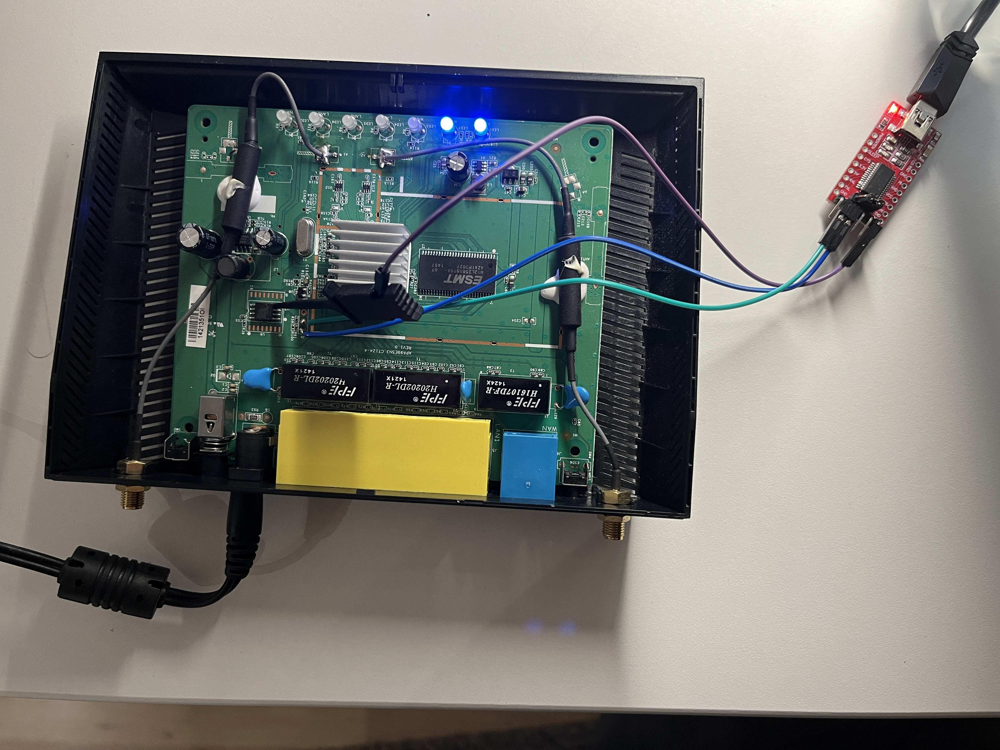

# Work in Progress

In this chapter we want to give an hands on example on how to hack your first IoT device and dive into hardware hacking.

I found this old Asus router in the basement, which was replaced a long time ago and was not of any use anymore. A perfect target for a hardware hacking experiment!

## Reconnaissance

#### OSINT

In the first step I googled the model number for my router "ASUS RT N12 D1" and I came accross this [article](https://redfoxsec.com/blog/asus-rt-n12-b1s-privilege-escalation-cve-2024-28326/). It shows that a similar model the  "ASUS RT N12+ B1" appears to have an open UART interface, which gives unauthenticated root access. It does not show how to exacltly abuse this or any details where to find the UART interface.  Let's see if our router model may have the same vulnerability!

Moreover we find the FCC ID on the back of the router:

<figure><figcaption><p>FCC ID</p></figcaption></figure>

In the US every device, which provides RF communication like an router must have an FCC-ID. The Federal Communications Commission (FCC) will publish an report including internal pictures of each device. So we can take a look on internal pictures of the router without the need to open it!

As you can see there are 4 connector pads on the top right of the PCB. This layout is very typical for a UART interfaces, which often provides 4 pins (RX,TX,VCC,GND).

#### Open the device

Enough research! Let's take a look for ourselves and open the device.  Our goal is to identify components of interest, which might be storing chips like RAM or flash chips, debug ports and interfaces. It's always a good idea to take a  of your device and label component, which you could identify.

<figure><figcaption><p>Identified components</p></figcaption></figure>

&#x20;As we can see next to the flash chip there are 4 connector pins. Using a multimeter, we can try to identify each of the pins performing a continuity test. For that we need test points for ground and power. We can use the GND and VCC pins of the flash chip as a reference, since we can look them up on the datasheet of the flash chip.

<figure><figcaption><p>Flash chip pinout</p></figcaption></figure>

Using this method we can easily identify GND and VCC. To distinguish TX and RX pins, we can power on the device and see that one of the pin has a fluctuating voltage ranging from 1.8 to 3.3 V. This pin should be the TX pin of the UART interface. Hence, we got this layout:

<figure><figcaption><p>UART interface pinout</p></figcaption></figure>

## Interface Interaction

To interact with the UART interface we need an UART-to-TTL USB adapter. We can then connect the adpter accordingly. Make sure to connect RX to TX and TX to RX.

The final setup may look like this. Note I didn't bother to solder the GND pin, but just used a clip on the flash chip.

<figure><figcaption><p>UART adapter connected</p></figcaption></figure>

Using minicom we set the baud rate to 115200 and power on the router. We immediately see the bootlog is printed out!&#x20;

<details>

<summary>Extend to see the full bootlog</summary>

```
Decompressing...done


CFE version 5.100.138.9 based on BBP 1.0.37 for BCM947XX (32bit,SP,LE)
Build Date: 二 10月  2 17:29:48 CST 2012 (root@raymonddev-vm)
Copyright (C) 2000-2008 Broadcom Corporation.

Init Arena
Init Devs.
Boot partition size = 131072(0x20000)
Found an ST compatible serial flash with 128 64KB blocks; total size 8MB
et0: Broadcom BCM47XX 10/100/1000 Mbps Ethernet Controller 5.100.138.9
CPU type 0x19749: 300MHz
Tot mem: 32768 KBytes

CFE mem:    0x80700000 - 0x80799720 (628512)
Data:       0x8072F560 - 0x80732790 (12848)
BSS:        0x80732790 - 0x80733720 (3984)
Heap:       0x80733720 - 0x80797720 (409600)
Stack:      0x80797720 - 0x80799720 (8192)
Text:       0x80700000 - 0x8072F560 (193888)

Device eth0:  hwaddr 78-24-AF-CC-A4-84, ipaddr 192.168.200.100, mask 255.255.255.0
        gateway not set, nameserver not set
end of nvram_rescuegpio_init
Loader:raw Filesys:tftp Dev:eth0 File:: Options:(null)
Loading: CFE works as TFTP Server.
Failed.
Could not load :: Timeout occured
Loader:raw Filesys:raw Dev:flash0.os File: Options:(null)
Loading: .. 5100 bytes read
Entry at 0x80001000
Closing network.
Starting program at 0x80001000
start_kernel
Linux version 2.6.22.19 (root@asus) (gcc version 4.2.4) #1 Thu Mar 12 11:45:07 CST 2020
CPU revision is: 00019749
Found an ST compatible serial flash with 128 64KB blocks; total size 8MB
Determined physical RAM map:
 memory: 02000000 @ 00000000 (usable)
Built 1 zonelists.  Total pages: 8128
Kernel command line: root=/dev/mtdblock2 noinitrd console=ttyS0,115200
Primary instruction cache 32kB, physically tagged, 4-way, linesize 32 bytes.
Primary data cache 32kB, 4-way, linesize 32 bytes.
Synthesized TLB refill handler (20 instructions).
Synthesized TLB load handler fastpath (32 instructions).
Synthesized TLB store handler fastpath (32 instructions).
Synthesized TLB modify handler fastpath (31 instructions).
PID hash table entries: 128 (order: 7, 512 bytes)
CPU: BCM53572 rev 1 pkg 8 at 300 MHz
Using 150.000 MHz high precision timer.
console [ttyS0] enabled
Dentry cache hash table entries: 4096 (order: 2, 16384 bytes)
Inode-cache hash table entries: 2048 (order: 1, 8192 bytes)
Memory: 28924k/32768k available (2452k kernel code, 3844k reserved, 495k data, 160k init, 0k highmem)
Mount-cache hash table entries: 512
NET: Registered protocol family 16
PCI: no core
PCI: no core
PCI: Fixing up bus 0
NET: Registered protocol family 2
Time: MIPS clocksource has been installed.
IP route cache hash table entries: 1024 (order: 0, 4096 bytes)
TCP established hash table entries: 1024 (order: 1, 8192 bytes)
TCP bind hash table entries: 1024 (order: 0, 4096 bytes)
TCP: Hash tables configured (established 1024 bind 1024)
TCP reno registered
squashfs: version 3.2-r2 (2007/01/15) Phillip Lougher
io scheduler noop registered (default)
HDLC line discipline: version $Revision: 4.8 $, maxframe=4096
N_HDLC line discipline registered.
Serial: 8250/16550 driver $Revision: 1.90 $ 4 ports, IRQ sharing disabled
serial8250: ttyS0 at MMIO 0xb8000300 (irq = 8) is a 16550A
PPP generic driver version 2.4.2
MPPE/MPPC encryption/compression module registered
NET: Registered protocol family 24
PPPoL2TP kernel driver, V0.18.3
PPTP driver version 0.8.5
pflash: found no supported devices
Creating 5 MTD partitions on "sflash":
0x00000000-0x00020000 : "pmon"
0x00020000-0x007f0000 : "linux"
0x0011bf4c-0x00710000 : "rootfs"
0x007f0000-0x00800000 : "nvram"
0x00770000-0x007f0000 : "jffs2"
dev_nvram_init: _nvram_init
_nvram_init: allocat header: 2151579648, size= 32768
sdhci: Secure Digital Host Controller Interface driver
sdhci: Copyright(c) Pierre Ossman
u32 classifier
    OLD policer on 
Netfilter messages via NETLINK v0.30.
nf_conntrack version 0.5.0 (512 buckets, 4096 max)
ip_tables: (C) 2000-2006 Netfilter Core Team
net/ipv4/netfilter/tomato_ct.c [Mar 12 2020 11:44:11]
NET: Registered protocol family 1
NET: Registered protocol family 10
ip6_tables: (C) 2000-2006 Netfilter Core Team
NET: Registered protocol family 17
802.1Q VLAN Support v1.8 Ben Greear <greearb@candelatech.com>
All bugs added by David S. Miller <davem@redhat.com>
VFS: Mounted root (squashfs filesystem) readonly.
Freeing unused kernel memory: 160k freed
Warning: unable to open an initial console.
1: set_action 0
firmware version: 3.0.0.4.380_8292-ge6e0d75d7df
[1 init:init_nvram +5] init_nvram for model(29)
num_of_mssid_support(0x0089): [mssid] support [3] mssid
ctf: module license 'Proprietary' taints kernel.
et_module_init: passivemode set to 0x0
hotplug net INTERFACE=eth0 ACTION=add
eth0: Broadcom BCM47XX 10/100/1000 Mbps Ethernet Controller 5.110.27.20012
set_wltxpower(0x01d0): [rc] no Power Control on this model
hotplug net INTERFACE=eth0 ACTION=add
wl_module_init: passivemode set to 0x0
hotplug net INTERFACE=eth1 ACTION=add
eth1: Broadcom BCM4347 802.11 Wireless Controller 5.110.27.20012
hotplug net INTERFACE=eth1 ACTION=add
start_logger:
Algorithmics/MIPS FPU Emulator v1.5
/ # _ifconfig: name=eth0 flags=1043 IFUP addr=(null) netmask=(null)
hotplug net INTERFACE=vlan0 ACTION=add
hotplug net INTERFACE=vlan0 ACTION=add
hotplug net INTERFACE=vlan1 ACTION=add
hotplug net INTERFACE=vlan1 ACTION=add
update_lan_state(lan_, 0, 0)
start_lan: setting up the bridge br0
hotplug net INTERFACE=br0 ACTION=add
vlan0: cmd=14: Operation not supported
_ifconfig: name=vlan0 flags=1243 IFUP addr=(null) netmask=(null)
start_lan: setting MAC of br0 bridge to 78:24:AF:CC:A4:84
hotplug net INTERFACE=br0 ACTION=add
_ifconfig: name=eth1 flags=1243 IFUP addr=(null) netmask=(null)
generate_wl_para(0x0a6f): unit 0 subunit -1
num_of_mssid_support(0x0089): [mssid] support [3] mssid
generate_wl_para(0x0d8d): bw: 1
generate_wl_para(0x0d92): channel: 0
generate_wl_para(0x0d93): nbw_cap: 1
generate_wl_para(0x0d94): nctrlsb: lower
generate_wl_para(0x0d96): obss_coex: 1
generate_wl_para(0x0a6f): unit 0 subunit 1
generate_wl_para(0x0a6f): unit 0 subunit 2
generate_wl_para(0x0a6f): unit 0 subunit 3

_ifconfig: name=br0 flags=1243 IFUP addr=192.168.1.1 netmask=255.255.255.0
_ifconfig: name=lo flags=1043 IFUP addr=127.0.0.1 netmask=255.0.0.0
route_manip: cmd=ADD name=lo addr=127.0.0.0 netmask=255.0.0.0 gateway=0.0.0.0 metric=0
update_lan_state(lan_, 1, 0)
start_lan 1928
udhcpc_lan:: deconfig
deconfig_lan: IFUP.
_ifconfig: name=br0 flags=1243 IFUP addr=192.168.1.1 netmask=255.255.255.0
lan_down(br0)
route_manip: cmd=DEL name=br0 addr=0.0.0.0 netmask=0.0.0.0 gateway=192.168.200.1 metric=0
update_lan_state(lan_, 4, 0)
done
# wanduck: Got LAN(-1) information:
wanduck: delay 1 seconds before the first detect...
[1 init:start_dnsmasq +12] begin
[1 init:stop_dnsmasq +12] begin
[1 init:stop_dnsmasq +12] end
start_lan_port(0) 1
TZ watchdog
wanduck: delay 2 seconds before the first detect...
illegal, cannot enable DualWAN
vlan0: cmd=14: Operation not supported
wanduck: delay 3 seconds before the first detect...
[1 init:init_main +14] recv signal 14 from pid [1:/sbin/init] (from user)
wanduck: delay 4 seconds before the first detect...
[1 init:init_main +15] recv signal 14 from pid [1:/sbin/init] (from user)
wanduck: delay 5 seconds before the first detect...

/ # udhcpc_lan:: leasefail

/ # 
/ # 
/ # 


```

</details>

Moreover after the router bootprocess is finished, the UART interface gives us a unauthenticated root shell!

<figure><figcaption></figcaption></figure>

