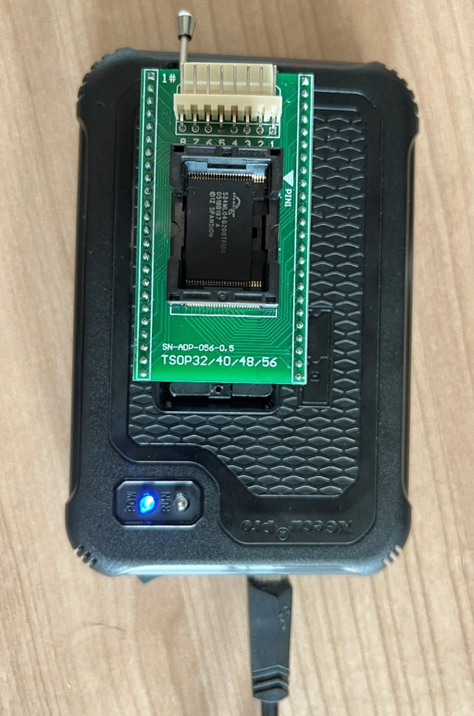
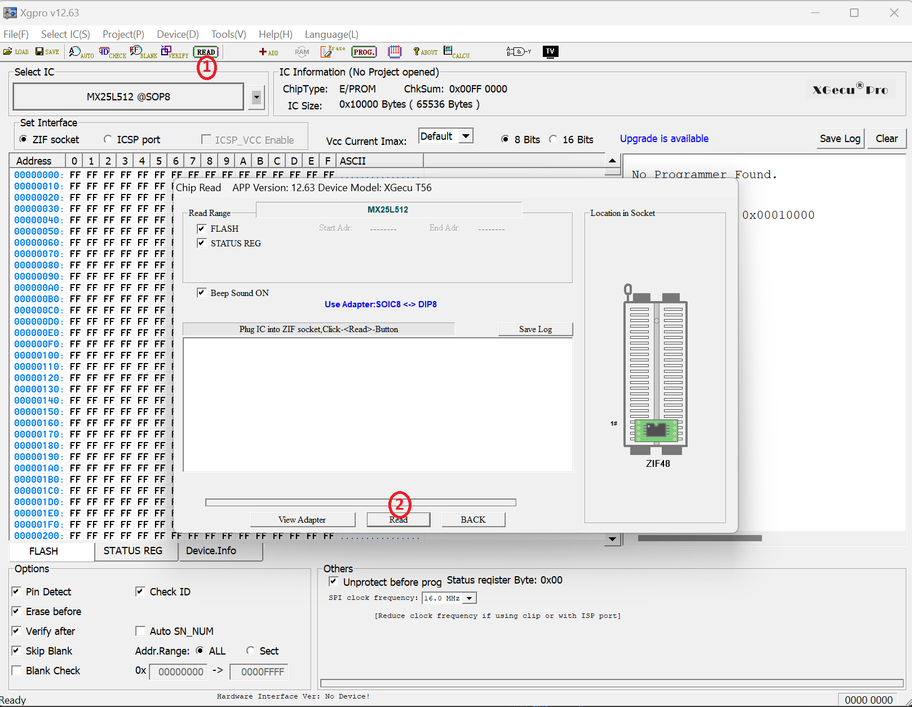

# Xgecu T56

The Xgecu T56 is a universal programmer that supports a wide range of memory chips, including EEPROM, flash memory, and microcontrollers. It is designed for both hobbyists and professionals, offering a compact design, user-friendly interface, and extensive compatibility with various chip types. The T56 is known for its high-speed programming capabilities and can be used for tasks such as reading, writing, and erasing memory chips, making it a valuable tool for hardware pentesters and developers.

## Key Features

* Wide Compatibility
  * Supports thousands of memory devices from various manufacturers, including NAND, NOR, and EEPROM chips by using adapters of different sizes
* User-Friendly Software
  * Comes with easy-to-use software that allows for quick setup and operation.
* High-Speed Programming
  * Capable of fast read and write operations, improving workflow efficiency.
* Portable Design
  * Compact size makes it easy to carry and integrate into various environments.

It makes a lot of sense to also buy various adapters (which often come in sets), so we can support different kind of chip sizes.

<figure><figcaption>
TSOP32/40/48/56 Adapter in use
</figcaption></figure>

## Example Commands to Dump a Flash Chip Using Xgecu T56

To dump a flash chip using the Xgecu T56 programmer, you typically use the provided software that comes with the device. Here's a step-by-step guide to dumping flash memory:

1. Install the Software:
   * Download and install the Xgecu software from the official website or provided installation media.
2. Connect the Xgecu T56:
   * Connect the Xgecu T56 to your PC via USB.
   * Insert the flash chip into the appropriate socket on the programmer. Ensure the chip is oriented correctly according to the pinout.
3. Launch the Xgecu Software:
   * Open the installed Xgecu software on your computer. In the software, select the type of chip you are using from the list of supported devices. If the chip is not listed, you may need to check compatibility or update the software database.
   *

       <figure><figcaption></figcaption></figure>
4. Configure Settings:
   * Set the programming parameters if necessary (e.g., voltage levels, timing settings). Most settings can usually be left at default for standard operations.
5.  Read and Save the Flash Memory:

    * Click on the Read button or option in the software interface to start reading the flash chip. The software will typically show a progress indicator.
    * The data will be read from the chip and displayed in the software. You can save the data using the Save button.

    <figure><figcaption></figcaption></figure>
6.  Read Data is shown in the hex dump

    <figure><figcaption></figcaption></figure>
7. Verify the Data:
   * Optionally, you can verify the data by reading it back from the saved file and comparing it with the original content.
8. Disconnect and Exit:
   * Once the dump is complete, safely disconnect the flash chip from the programmer and exit the software.

## Resources

[http://xgecu.com/MiniPro/T56\_TL866II%20USER%20GUIDE.pdf](http://xgecu.com/MiniPro/T56\_TL866II%20USER%20GUIDE.pdf)
