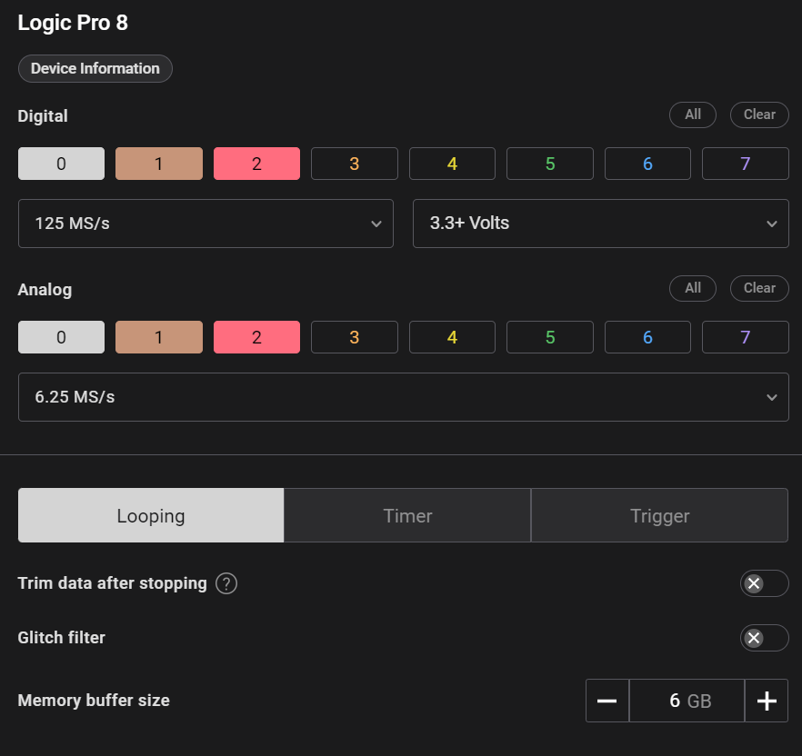
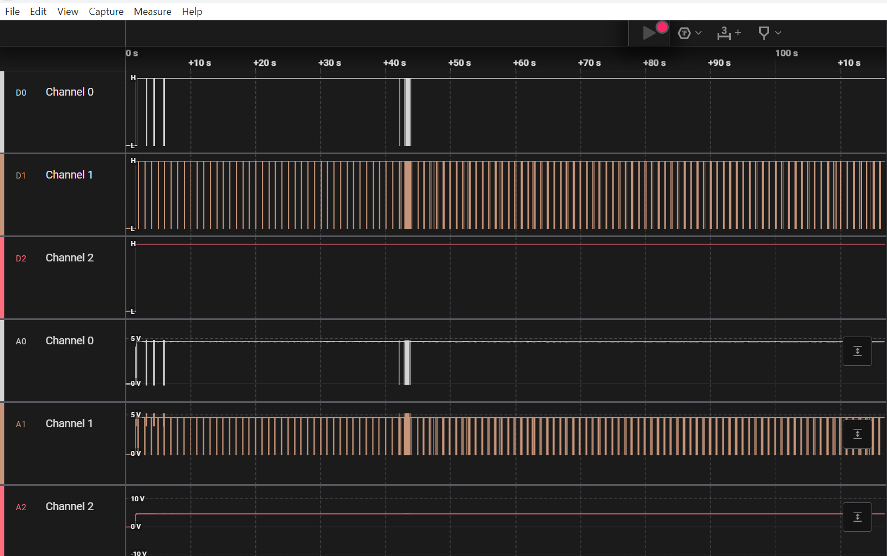
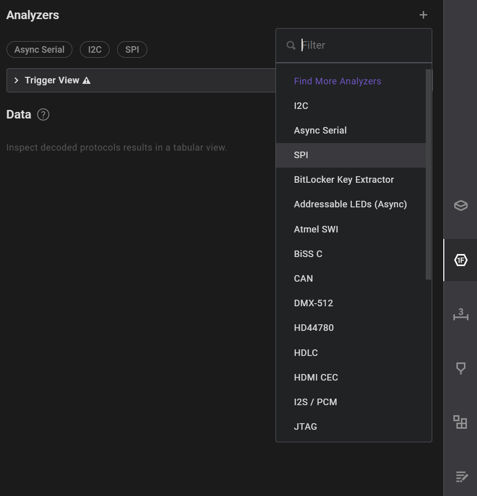
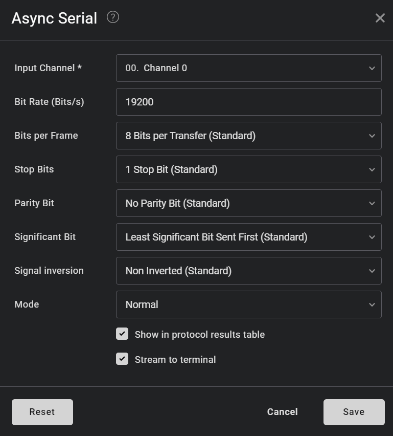
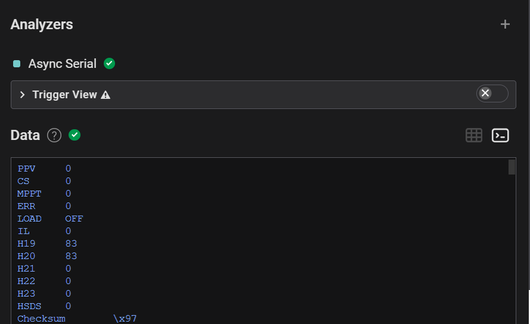
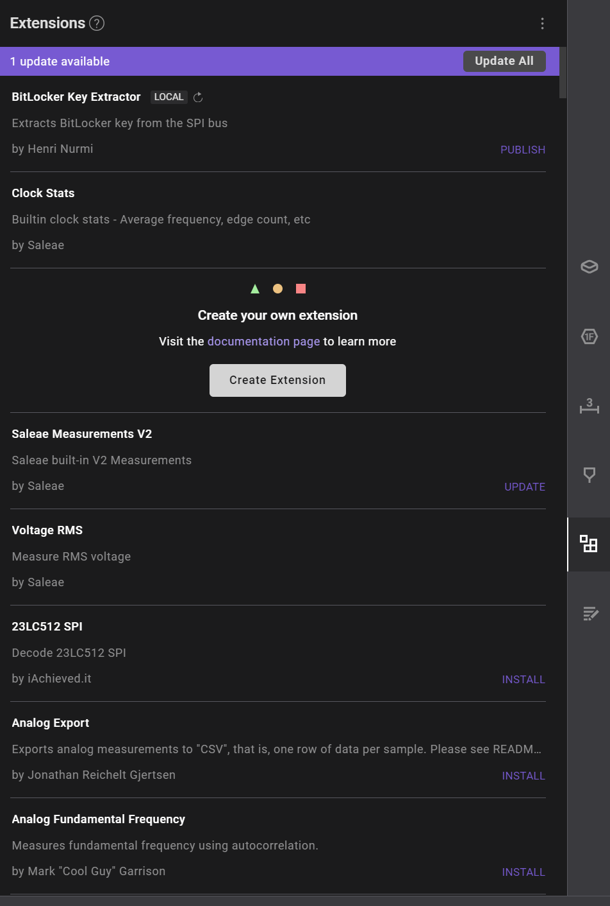

# Saleae Logic Analyzer

## Theory

Saleae Logic is a popular line of logic analyzers known for their ease of use, versatility, and powerful software capabilities. They are designed for both hobbyists and professionals looking to debug and analyze digital signals and protocols in electronic circuits.

#### Requirements

* Computer with USB Port
* Target Device

#### Software

* The device is accompanied by proprietary software that is available for free. It provides a user-friendly interface for capturing, visualizing, and analyzing data.
  * Features:
    * Waveform visualization.
    * Protocol decoding for various standards like SPI, I2C, UART, and more.
    * Ability to save and load projects.
    * Data export in various formats (CSV, etc.).

## Usage

1. Setup:
   * Connect the Saleae Logic analyzer to your computer via USB.
   * Connect the probes to the target device's test points to capture the digital signals.
2. Launch Software:
   * Open the Saleae Logic software on your computer.
3. Configure Channels:
   * Select the channels you want to monitor and set their voltage levels.
   * Choose the sampling rate based on the speed of the signals you're analyzing.
   *   higher sampling rate => more data points, but also more memory usage

       <figure><figcaption></figcaption></figure>
4.  Capture Data:

    * Click the capture button to start collecting data.
    * Use the triggering options to capture specific events or signals of interest.

    <figure><figcaption></figcaption></figure>
5.  Analyze Data:

    * Use the software to visualize the waveform data.
    * Utilize the decoding feature to interpret the protocol data, making it easier to analyze complex communication

    <figure><figcaption></figcaption></figure>
6.  For any analyzer we can specify settings (here for the Async Serial Analyzer);

    <figure><figcaption>
Async Serial Analyzer settings
</figcaption></figure>
7. Once we save the settings Saleae will automatically analyzer our captured data.
8.  Example output:

    <figure><figcaption>
Analyzer in graph
</figcaption></figure>
9.  We can also look at the decoded in the terminal view

    <figure><figcaption>
Analyzer in terminal
</figcaption></figure>
10. If you don't find the correct analyzer for your protocol you may use extensions to load your custom analyzers:
    1.

        <figure><figcaption>
Saleae extensions
</figcaption></figure>

## Resources

[https://support.saleae.com/getting-started/setup](https://support.saleae.com/getting-started/setup)\
