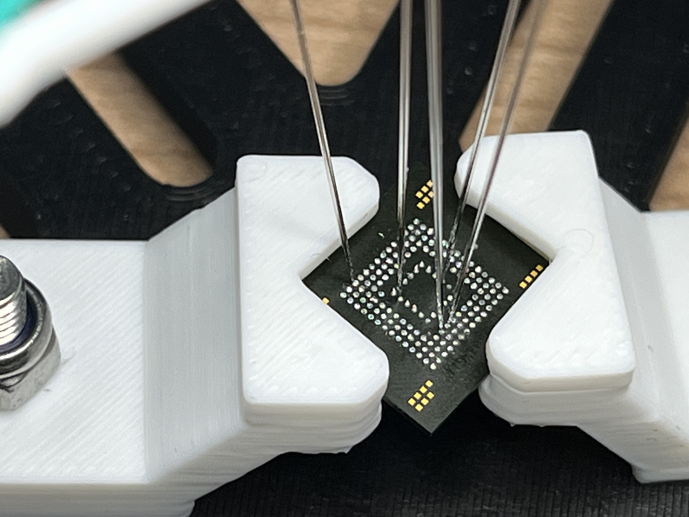

# Extract Firmware using SPI

Requirements:

* external SPI flash, which has firmware stored
* SPI capable reader (Buspirate, RaspberryPi, Xgecu T56, etc.)

Let's say you find an external flash memory on a PCB: chances are good that it will store interesting information like the bootloader or the root-filesystem.

## Steps to Extract Firmware:

1. Identify the used flash chip by Google the chip description printed on it
   1. in the datasheet of the chip you should find the pinout of the chip (the dot on the chip specifies the upper left corner
   2.  Example Pinout:

       <figure><figcaption>
Example pinout of a flash chip
</figcaption></figure>

2. Connect your Flash reader probes to the pins of the chip:



The quickest and easiest way to connect to a flash chip is by using a clamp, like these:

<figure><figcaption>
Clamps can be used to connect to pins on chip
</figcaption></figure>

Attach the clamp to the chip and the end to your programmer/debugger like the Bus Pirate or an Xgecu T56.

<figure><figcaption>
clamps connected to an SPI flash
</figcaption></figure>



If you don't have a clamp, you can also solder cables directly to the needed pins:

<figure><figcaption></figcaption></figure>



**If Unsuccessful:** The methods before can be unsuccessful as the MCU on the PCB inteferes with the flash chip, making it unable to read out. In that cases you can try to:

1. Remove clock crystal on the PCB to stop the MCU from running
2. desolder the flash chip and read it out separately using XGECU T56 for example

If the chip has internal pins (BGA layout) you might be required to desolder the chip.

If you desoldered the chip, you can:

1. solder jumper cables on the correct pins
2. read the chip out by placing it on an adapter, like the XGecu T56:

<figure><figcaption>
SPI flash is read out using Xgecu T56
</figcaption></figure>



You can also 3D-Print Board Probe Testing Jig like this one:

<figure><figcaption></figcaption></figure>

The needles probes will directly connect to the pins on the chip:

<figure><figcaption></figcaption></figure>


