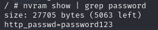
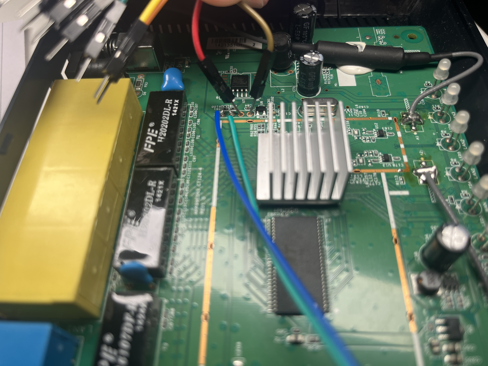
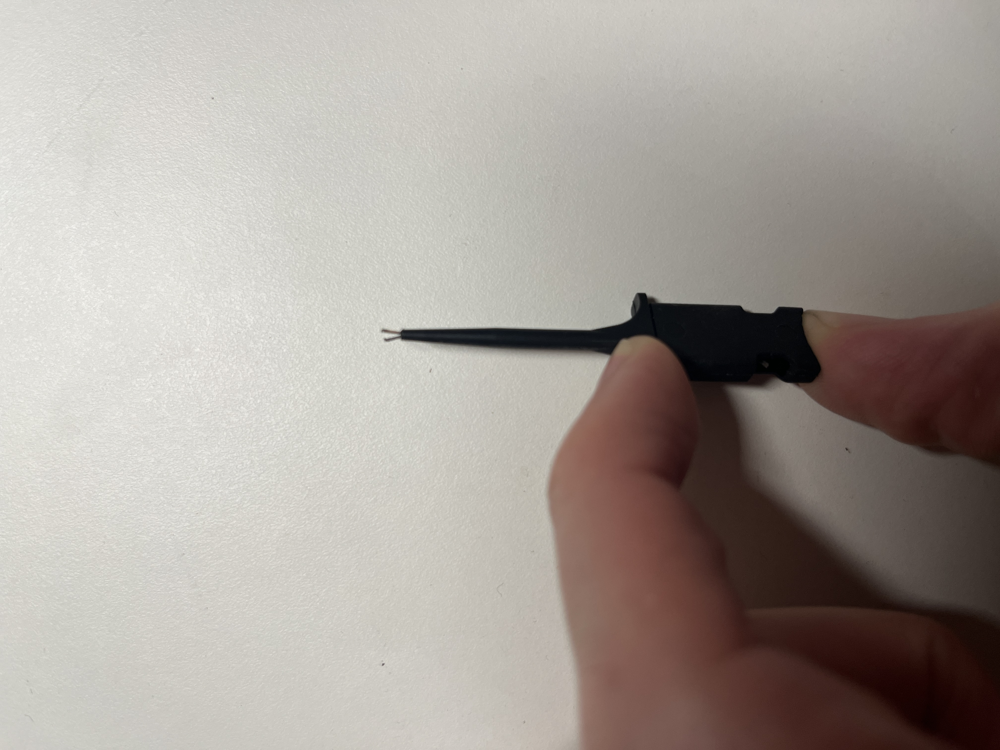
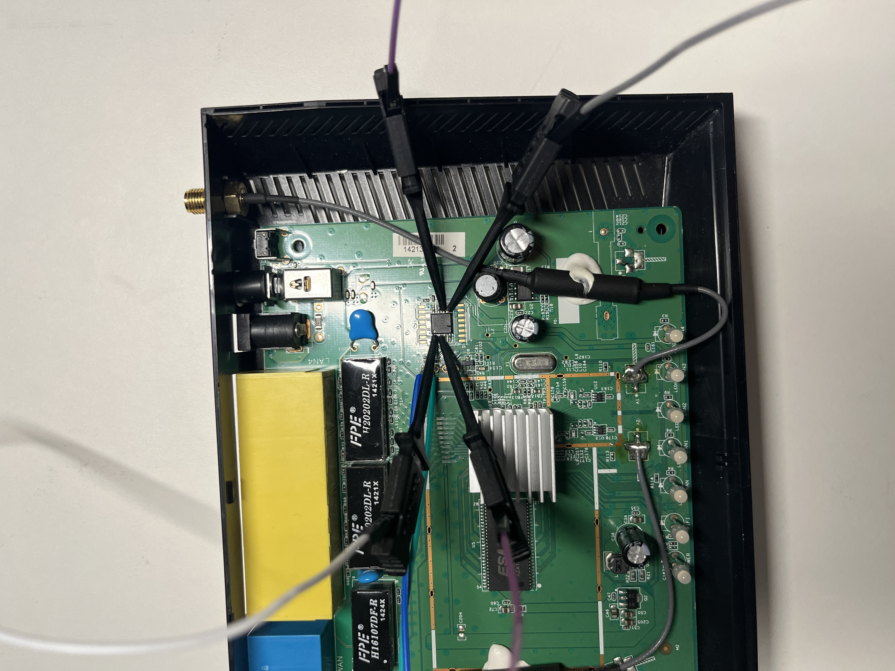
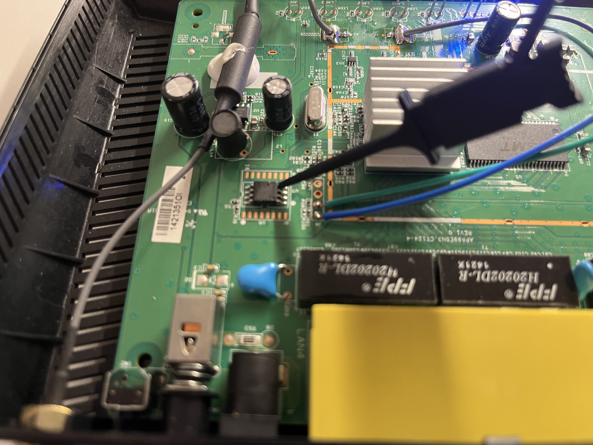
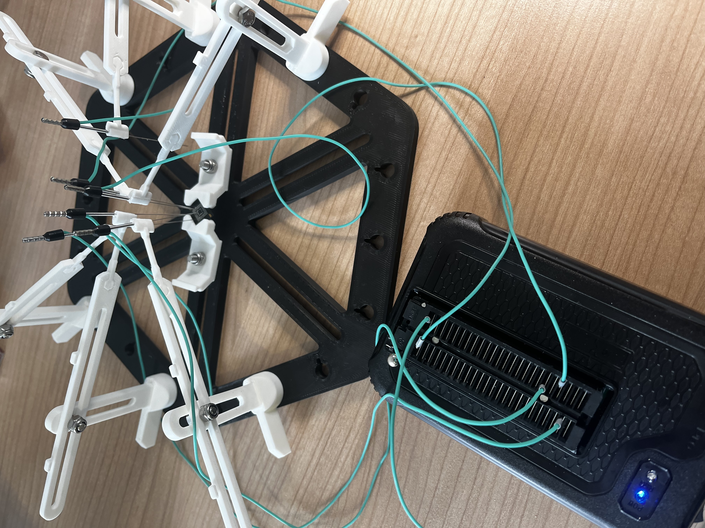

# Connect to UART

S**cenario:**&#x20;

You followed "[Board Analysis](../../reconnaissance/opened-device/board-analysis.md)" and could identify an active UART interface

## Connect to UART

You need to find the GND (ground), TX (transmit) and RX(receive) pins to communicate with UART.&#x20;

When you connect the UART-USB adapter with the UART interface on the board, you have to connect RX and TX together like this:

<figure><figcaption><p>Connect RX to TX and TX to RX</p></figcaption></figure>

There are different ways to connect to identified test pads:



If you are lucky, you find header pins where you can connect jumper cables to it. This is the easiest way to connect your UART-to-TTL USB adapter to an UART interface.

<figure><figcaption><p>Header pins exposed, connect jumper cables here<br><br></p></figcaption></figure>

If your device has holes in the pcb for the UART connection, you can attempt to put jumper cables through it and tilt them, so they have a solid contact point:

<figure><figcaption><p>Put the male pins through the connector holes</p></figcaption></figure>



If you own clamps or grabbers, you can use them to hook them up to the UART connector.  These clamps have small hooks which you can hookup to the connector. This is not very usable if you only have flat connector pads.

<figure><figcaption><p>Clamp with Hook<br></p></figcaption></figure>

Here an example when the clamps are attached:

<figure><figcaption><p>Clamps attached</p></figcaption></figure>



Another option is to solder cables to the connector you found. This is especially useful if you only find flat pads to connect to.

<figure><figcaption><p>Two cables soldered to UART connector (RX/TX)</p></figcaption></figure>



Next, you can also connect your adapter to the UART interface using probes like the professional [PCBite](https://sensepeek.com/) or self-printed versions like this one:

<figure><figcaption><p>Connect the needle pins to the UART interface</p></figcaption></figure>



## Interact with UART

On your PC use the following command to communicate over UART (you may have to adjust the baud rate)



```bash
sudo minicom -D /dev/ttyUSB0 -b 115200
sudo picocom -b 115200 -r -l /dev/ttyUSB0
```



**Using PuTTY (Windows)**:

* Select “Serial” and enter the COM port (e.g., COM3) and baud rate (115200).



5. If you see readable data: You done it correctly!

<figure><figcaption><p>Bootlog</p></figcaption></figure>

**Congrats!** You found your first serial connection! Check out the UART chapter on how to use this to dump the firmware from the device.
