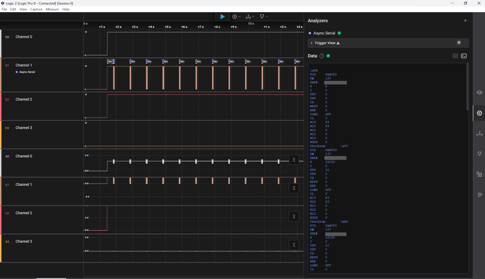

# VE.Direct

## **Theory**

The VE.Direct protocol is a communication interface developed by Victron Energy, primarily for their energy monitoring products. This protocol is designed for real-time data exchange between devices like Battery Management Systems (BMS), solar charge controllers, and various monitoring devices. VE.Direct uses a simple serial connection with a standard UART interface, enabling data transfer at a low baud rate (commonly 19,200 bps). This protocol is especially useful for monitoring device metrics, such as voltage, current, and battery capacity, which can be helpful for energy management and control.

Data in VE.Direct is mainly transmitted as ASCII text in a predefined message format, making it easy to parse and interpret. During setup of a new connected device, there might be also hex strings transmitted. The protocol's simplicity is a double-edged sword: while it’s efficient for quick data retrieval, the lack of encryption or authentication makes it susceptible to interception or manipulation if physical access is available. This feature is crucial for pentesters as it opens the door for potential vulnerabilities, especially if critical devices rely on VE.Direct for automated decision-making processes.

Serial configuration of VE.Direct:

Baud rate: 19200 Data bits: 8 Parity: None Stop bits: 1 Flow control: None

<figure><figcaption><p>Pinout of VE.DIrect connector<br></p></figcaption></figure>

**Pinout:** &#x20;

1= GND

2=RX

3=TX

4= Power (5V)

**Message format:**

VE.Direct has a number of possible fields, here we exaplain a few common:

| Field    | Example Value | Description                                                                                        |
| -------- | ------------- | -------------------------------------------------------------------------------------------------- |
| PID      | 0xA053        | Product ID of the device, used to identify the specific model and type of device.                  |
| FW       | 137           | Firmware version, useful for knowing the device’s software version.                                |
| SER#     | XXXXXX        | Serial number of the device, typically unique to each device.                                      |
| V        | 11680         | Battery voltage in millivolts (mV). Here, 11680 mV equals 11.68 V.                                 |
| I        | 0             | Battery current in milliamperes (mA). Positive values mean charging, negative indicate discharge.  |
| VPV      | 10            | Panel voltage in mV. Shows the voltage from connected solar panels.                                |
| PPV      | 0             | Panel power in watts (W), calculated as voltage times current of the panels.                       |
| CS       | 0             | Charge state indicator, where 0 means "Off" and higher values indicate other charging states.      |
| MPPT     | 0             | Maximum Power Point Tracking (MPPT) mode; 0 means disabled.                                        |
| ERR      | 0             | Error code; 0 indicates no error. Different values represent various error states.                 |
| LOAD     | ON            | Load output status; "ON" means the load output is active.                                          |
| IL       | 0             | Load current in mA, showing the current drawn by the load.                                         |
| H19      | 83            | Yield total in kilowatt-hours (kWh), representing the total energy yield since installation.       |
| H20      | 83            | Yield today in kWh, showing energy produced in the current day.                                    |
| H21      | 0             | Maximum power today in W, showing peak power achieved.                                             |
| H22      | 0             | Maximum power yesterday in W, showing peak power from the previous day.                            |
| H23      | 0             | Yield yesterday in kWh, showing energy produced the previous day.                                  |
| HSDS     | 0             | Day sequence number; increments daily and helps track historical data over time.                   |
| Checksum | \xF0          | The checksum is correct, if the sum of whole massage (including the checksum) equals 0 modulo 256. |

## **Attacks**

### Sniffing

To sniff what data is send over VE.Direct we can use tools like an UART-to-TTL USB adapter or Saleae Logic Analyzer:



We have to connect RX,TX and GND to our adapter and start minicom etc. on baud rate 19200

```bash
sudo minicom -D /dev/ttyUSB0 -b 19200
sudo picocom -b 19200 -r -l /dev/ttyUSB0
```

The output may look like this: (Serial number blanked)

```
PID     0xA053
FW      137
SER#    XXXXXX
V       11680
I       0
VPV     10
PPV     0
CS      0
MPPT    0
ERR     0
LOAD    ON
IL      0
H19     83
H20     83
H21     0
H22     0
H23     0
HSDS    0
Checksum        \xF0

PID     0xA053
FW      137
SER#    XXXXX
V       11650
I       0
VPV     10
PPV     0
CS      0
MPPT    0
ERR     0
LOAD    ON
IL      0
H19     83
H20     83
H21     0
H22     0
H23     0
HSDS    0
Checksum        \xD4
```



Connect GND, RX and TX to your Saleae and start an Async Serial Analyzer at baud rate 19200

<figure><figcaption><p>Intercepted Data of an MPPT controller</p></figcaption></figure>



### Spoofing

Since the VE.Direct protocol does not require authentication, we can also spoof our own packages and send them to the control panel, which will then be accepted. Therefore we can simply record a original message and then replay it. We can also change every parameter of this message, this however requires us to change the Checksum accordingly.

## Resources

[https://www.victronenergy.com/upload/documents/VE.Direct-Protocol-3.33.pdf](https://www.victronenergy.com/upload/documents/VE.Direct-Protocol-3.33.pdf)\
[https://github.com/karioja/vedirect](https://github.com/karioja/vedirect)
