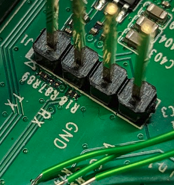

# Board Analysis

It's important to take your time to enumerate the PCB you want to test. Overlooking components or interfaces can waste a lot of time.

To analyze a PCB board, you need:

* Multimeter
* a camera/phone can be useful

What we are looking for:

* places where information may be stored
* places where we can communicate with the device
* places where we can intercept communication

These omponents of interest could be:



* Why it’s interesting
  * Interfaces like UART, SPI, I2C, and JTAG allow communication between components and can offer access to debugging or internal system states.
* Pentesting focus
  * Can give debugging access, unauthorized data interception, or to bypass authentication mechanisms
*   Examples:

    * Sometimes pins are directly exposed:

    <figure><figcaption>
Header-pins exposed
</figcaption></figure>

* Sometimes there also available as golden/silver test pads:

<figure><figcaption>
 
</figcaption></figure>

Todos:

*   Identify what connector pins you find (if they are not labeled)

    * Put your multimeter in continuity mode (often a "sound" symbol):

    <figure><figcaption></figcaption></figure>

    * This mode will check if there is a direct link between two points on the pcb
    * Put one probe on the connector pad you want to test and the other one goes on the chip (datasheet will tell you what pins are used for UART/SPI/JTAG)

    <figure><figcaption>
How to probe
</figcaption></figure>

    * Try to identify all required pins for the corresponding protocol.
* If you can't use the microchips pins as reference (for example if it's a BGA chip or if there is no datasheet) you can check the voltage of the pins:
  * High constant (around 3.3V or 5V)  indicates VCC
  * If the voltage fluctuates this may indicate data transmission (try a [Logic Analyzer](../../basics/tools/hardware-tools/logic-analyzer/))
  * Zero voltage indicates GND



* Why it’s interesting
  * These are the "brains" of the device, containing firmware and handling communication between components. Vulnerabilities in their firmware or boot process can be exploited to bypass security measures.
* Pentesting focus
  * &#x20;Identify debug interfaces (e.g., JTAG, SWD), probe for firmware extraction, inspect for vulnerabilities in the bootloader or firmware updates.
* Example

<figure><figcaption>
Example MCU
</figcaption></figure>

* Todos:
  * google the chip name (here STM32H7B0) and search for the datasheet
  * inside the datasheet look how to communicate with the chip: JTAG/UART/SPI etc.
  * identify these pins on the PCB and check where they are going



like Flash, EEPROM, RAM

* Why it’s interesting
  * These store sensitive information such as firmware, encryption keys, and user data. Analyzing memory chips can help retrieve critical data or alter firmware.
* Pentesting focus
  * Direct access to these chips for firmware dumping, encryption key recovery, or manipulating stored data (e.g., via SPI or I2C interfaces).
* Example:
  *   They come in different sizes and chapes

      <figure><figcaption>
Flash chip
</figcaption></figure>
* Todos:
  * google the chip name and search for the datasheet
  * inside the datasheet look how to communicate with the chip: I2C/SPI etc.
  * identify these pins on the PCB&#x20;
  * check the section "Extracting Firmware using SPI"



USB ports, Ethernet ports or SD card slots are also of interest for us. This part should have been done before opening the device. Check "[closed device](../closed-device/)" section.

* Why it’s interesting
  * These ports are common attack vectors for injecting malicious payloads or gaining unauthorized access.
* Pentesting focus
  * Inspect for insecure configurations, vulnerabilities in firmware updates via USB, and potential exploitation through interface protocols.



like Wi-Fi, Bluetooth, RF, ZigBee

* Why it’s interesting
  * &#x20;Wireless communication modules can introduce vulnerabilities like insecure transmission, poor encryption, or weak authentication.
*   Pentesting focus

    * Analyze for improper configuration, sniff traffic, and perform wireless-based attacks like jamming or eavesdropping.\

    Example GSM-module:

    <figure><figcaption></figcaption></figure>



I also recommend taking a high quality photo as soon as you open the device, as the printed model numbers can fade in daylight over time. You can then label the identified components on the picture, which will help you remember components you've already looked up.

Pictures with labeled components might look like this:

<figure><figcaption>
Labeled components
</figcaption></figure>

We should also remove any covers/labels/shields so we can identify the underlaying hardware:

<figure><figcaption>
Underlaying Hardware
</figcaption></figure>
